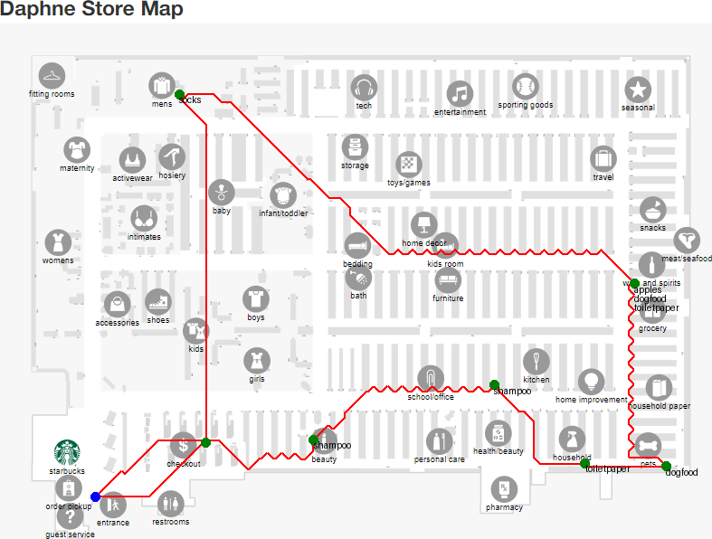

# Grocery Store Route Optimization

Application to take grocery store shopping list and grocery store location and create an optimal store route to find all items in the shortest path possible; deploy on web android iphone

Example:



# Route Creation API

This API allows you to create a route based on a given state, address, and grocery list. It returns an image of the generated route.

## Endpoint


`POST https://oj35b6kjt7.execute-api.us-west-2.amazonaws.com/default/`

valid functions are:

- `create_route`
- `get_categories`
- `get_route`
- `categorized_items`


## Authentication

Authentication is required for this API. Include your API key in the `x-api-key` header.

## Headers

| Header          | Value              | Description                             |
|-----------------|--------------------|-----------------------------------------|
| Content-Type    | application/json   | Specifies the request body format       |
| x-api-key       | Your-API-Key       | Your unique API key for authentication  |

## Request Body

The request body should be a JSON object with the following structure:

get_categories
```json
{
  "state": string,
  "address": string,
}
```

categorize_items
```json
{
  "categories": array of strings,
  "grocery_list": array of strings,
}
```

get_route and create_route
```json
{
  "state": string,
  "address": string,
  "grocery_dic": {
    "label":  array of strings
  }
}
```
### Fields

| Field         | Type     | Description                                        |
|---------------|----------|----------------------------------------------------|
| state         | string   | The state where the route should be created        |
| address       | string   | The full address for the route                     |
| grocery_list  | array    | An array of strings representing grocery categories|

## Response

### Success Response

- **Status Code:** 200 OK
- **Content-Type:** application/json

categorize_items
```json
{
  {
    "label":  array of strings
  }
}
```

get_categories
```json
{
  "labels": array of strings
}
```

get_route
```json
{
  "route": array of strings
}
```

create_route
```json
{
  "image": string
}
```

The `image` field contains a base64-encoded string representing the route image.

### Error Response

- **Status Code:** 4XX or 5XX
- **Content-Type:** application/json

```json
{
  "message": string
}
```

The `message` field contains information about the error.

## Example

### Request

```http
POST https://oj35b6kjt7.execute-api.us-west-2.amazonaws.com/default/create_route

Content-Type: application/json
x-api-key: vMEKwZ3DMH9CTzD0pmLcR5RQV95XeFoa2JjxyH89

{
  "state": "california",
  "address": "16858 Golden Valley Pkwy, Lathrop, CA 95330-8535",
  "grocery_dic": {
    "dairy": ["milk", "yogurt"],
  } 
}
```

### Response

```json
{
  "image": "base64_encoded_image_data"
}
```

## Notes

- The API key provided in the example (`vMEKwZ3DMH9CTzD0pmLcR5RQV95XeFoa2JjxyH89`) is just for demonstration purposes. Replace it with your actual API key; This key won't work. nice try
